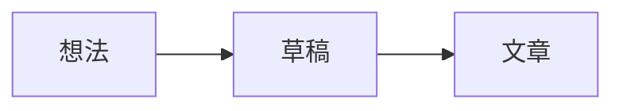

# 黄石的时空回环

Hugo 双语博客，使用仓库内维护的 [Loop 主题](themes/loop)。中文位于根目录，英文位于 `/en/`。原 Ink 子模块保留作历史参考。

### 本地运行

安装 Node.js 22、Python 3 与 **Hugo extended 0.161.1**（版本记录在 `.hugo-version`，CI 读取同一个文件）：

```sh
npm ci
npm run dev
# 包含草稿的预览
npm run dev -- --buildDrafts
```

`npm run dev` 先构建本地依赖，再启动 Hugo；修改 `themes/loop/assets/js/charts.js` 后需要重新执行 `npm run assets`。模板、主脚本、CSS 和文章由 Hugo 监听。

```sh
npm run build                     # 生成 public/
npm run check:site                # 检查历史 URL、翻译、索引和 RSS
npx playwright install chromium   # 首次安装浏览器
npm test                          # 自动启动 localhost:4173，运行浏览器测试
npm run check:rendering            # 隔离内容夹具：货币、隐藏/草稿、资源、评论配置
```

组件示例：本地 `/style-guide/` 与 `/en/style-guide/`，源文件为 [中文展示页](content/style-guide.md) 和 [英文展示页](content/style-guide.en.md)。两页均不进入文章列表、搜索索引或 RSS。

### 视觉与字体

Loop 使用近黑与白、细线框、等宽标注，以及橙黄色强调。参考 `infra-skills/openai-dotcom-viz` 提取的色板与图形语言；首页的回环线框是本站的原生 SVG，支持浅色、深色和无 JavaScript 浏览。

顶部将 THE LOOP 图形与四项主导航合并：导航位于图形下方的中央留白，以像素文字呈现，当前页面只用暖黄色文字与下划线标记。首页直接接文章列表，正文页使用较紧凑的页头。语言、配色与搜索使用方格像素图标；配色仍使用原生单选按钮，支持方向键、偏好保存、跟随系统及跨标签页同步；无脚本时仍保留全部导航和语言链接。

- 正文：中文 **Noto Sans SC Variable**、西文 **Geist Variable**，标题使用 500–550 字重；代码、日期和标注使用 **JetBrains Mono**。中文与西文字体通过锁定的 Fontsource 包提供，均附 OFL 许可证，不依赖访客安装字体或第三方字体 CDN。
- 导航：**Ark Pixel Font 12px Proportional / 简体中文**，以 18px 展示中英文导航。固定为官方 `2026.09.25` 版本，完整 WOFF2 字体（约 539 KiB）、来源说明与 OFL 许可证位于 `themes/loop/static/fonts/ark-pixel-2026.09.25/`；只用于四项导航，正文保持原排版。
- `npm run assets` 将字体 CSS 合并到 Hugo 样式资源，并复制其引用的 WOFF2 字符分片到 `themes/loop/static/fonts/generated/`。保留 `unicode-range` 按需下载，文件路径包含包版本。生成 CSS 与字体目录均忽略，由 `npm ci` 和构建脚本重建。
- 配色及字体变量集中在 `themes/loop/assets/css/loop.css`；图表读取同一组变量。ECharts 保留文章指定的系列颜色；Mermaid 保持严格模式。
- 柱状图默认使用 OpenAI dotcom 规范的完整圆角矩形（四角 4px）、1.5px 同色系深描边、圆形图例、柱顶数值与无网格坐标轴。默认暖橙深浅配对为 `#cc6f47 / #ffedde`；显式 `color`、`itemStyle` 和 `label` 配置优先。
- `` 可嵌入首页同款回环图形，标签随页面语言变化。双语样式指南包含示例。
- 头像、页头与 favicon 共用 `themes/loop/assets/images/loop-avatar.svg`，构建时发布为 `/loop-avatar.svg`。页内标识随主题切换颜色，小尺寸精简网格；独立 SVG 随系统配色切换。调整环面几何后可运行 `node scripts/draw-loop-avatar.mjs` 重新生成矢量源文件。

字体来源与许可：[Geist](https://fontsource.org/fonts/geist/about)、[Noto Sans SC](https://fontsource.org/fonts/noto-sans-sc/about)、[Ark Pixel Font](https://github.com/TakWolf/ark-pixel-font)。

### 写一篇文章

```sh
hugo new content blog/my-note.md
```

```yaml
---
date: "2026-09-17"
title: "一篇新记录"
slug: my-note
tags: [生活]
toc: true
draft: false
katex: false
comments: true
---
```

先写摘要，再使用 `<!--more-->`，正文标题从 `###` 开始。保留旧文章日期、slug 和文件名，避免改变现有 URL。翻译文件使用 `my-note.en.md`，与中文版本共享 `date` 和 `slug`。`hidden: true` 会从列表、归档、搜索和 RSS 中排除页面，直接 URL 仍可访问；私密内容不要提交到公开仓库。

### 公式与代码

公式文章需要 `katex: true`。推荐 `\(a_{n+1}=a_n+1\)`、`$$...$$` 或 `\[...\]`。兼容旧文 `$...$`；Goldmark passthrough 保留分隔符中的原始 LaTeX。KaTeX 由本站提供，每篇文章只执行一次初始化；未开启 `katex` 的页面不会加载公式库，也不会将 `$20` 当作公式。公式文章中的金额推荐使用行内代码，例如 `` `$20` ``；代码中的美元符号不会触发渲染。

````markdown
```python {linenos=table,linenostart=7,hl_lines=[2]}
def greet(name):
    return f"Hello, {name}"
```
````

保留 Hugo 的行号与高亮参数。复制按钮读取原始代码，排除行号；换行按钮用于长行。代码字体为本地 JetBrains Mono，附带 OFL 许可。

旧文章的四空格缩进代码和原始 `<pre>` 也会添加复制、换行按钮；关闭脚本时保留可读源码。

### 图表与流程图

````markdown
```echarts {title="每日阅读" description="三天分别阅读 20、35、30 分钟。" height="320"}
{"tooltip":{},"xAxis":{"type":"category","data":["Mon","Tue","Wed"]},"yAxis":{"type":"value"},"series":[{"type":"bar","data":[20,35,30]}]}
```


````

图表只接受 **JSON** 配置，不支持 JavaScript 函数。通过 ECharts 配置 `tooltip`、`legend`、`dataZoom` 开启悬停、图例选择与缩放。建议每个图表提供能脱离视觉阅读的 `description`，包括主要趋势或具体数值。

```go-html-template

```

`src` 优先匹配文章 bundle 内的资源；否则读取 `data/charts/week.json`（也可写 `src="data/charts/week.json"`）。文件路径必须存在，高度是 10–9999 的整数像素。无效 JSON 在浏览器中显示失败提示并保留源配置。示例数据见 [week.json](data/charts/week.json)。资源文件适用于 `content/blog/my-note/index.md` 与同目录的 JSON。

图表库按页面需要分包加载，调整容器宽度时重绘。ECharts 切换主题时保留图例选择、缩放等状态；Mermaid 使用严格模式重新绘制。加载失败及关闭 JavaScript 时，仍可阅读说明和源配置。

### 提示、折叠与标签页

```go-html-template

支持 **Markdown**。类型还可选择 `tip` 或 `warning`。



折叠内容。添加 `open=true` 可默认展开。




关键观点。


补充论证。


```

标签页支持方向键、Home / End 和 Tab；关闭脚本后按顺序显示所有内容。

提示块采用上下细分隔线与留白，折叠内容使用原生 `<details>` 和加减号，不使用加粗侧边或大面积彩色底。已发布文章的控件覆盖记录见 [published-components.md](docs/published-components.md)。

### 图片与已有写法

```markdown

```

```go-html-template



```

保留原始 HTML、Markdown 图片、`figure` 和 Gist 兼容性。图片懒加载；未带链接的正文图片可放大，Escape 关闭后焦点返回原图。原有外链图片仍使用原地址，不自动下载或替换。Gist 与 Utterances 仍是外部服务。

### 维护与发布

- `themes/loop/layouts/`：页面模板、短代码和渲染 hook；`assets/`：CSS 与原生 JavaScript。
- `i18n/`：中文、英文 UI 文案；`config.toml`：菜单、站点身份、头像及评论配置。
- `package-lock.json`：锁定前端依赖。`scripts/build-assets.mjs` 将 KaTeX 和图表分包构建到忽略的 `themes/loop/static/vendor/`，由本站提供。
- 主 CSS 和脚本使用 Hugo 指纹。图表分包使用内容哈希，入口随构建更新。修改依赖后运行 `npm run build`、`npm audit` 与浏览器测试；不要手改生成文件。
- 全站评论由 `[params.utter].enable` 控制，单页 `comments: false` 可关闭。评论进入视口附近时才加载，主题更新通过 Utterances 的消息接口同步。
- 配色保存为 `loop-theme`，支持 `light`、`dark`、`system`，首次读取兼容 Ink 的 `scheme`。本地存储不可用时仍可切换。
- `tests/fixtures/ink-baseline.json` 保存改版前路径、RSS 和首页分页。迁移验收可额外运行 `npm run check:site -- --baseline`；后续新增文章会正常改变 RSS 和分页，无需在日常 CI 中固定这些内容。
- GitHub Actions 在 PR 上构建并测试，推送 `hugo-source` 时通过原 GitHub Pages 流程发布。

实现依据：[Hugo passthrough](https://gohugo.io/render-hooks/passthrough/)、[代码渲染 hook](https://gohugo.io/render-hooks/code-blocks/)、[ECharts 容器尺寸](https://echarts.apache.org/handbook/en/concepts/chart-size/)、[Mermaid 严格模式](https://mermaid.js.org/config/schema-docs/config-properties-securitylevel.html)。验收记录见 [docs/verification.md](docs/verification.md)。
