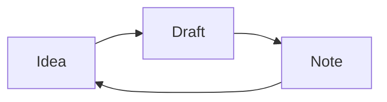
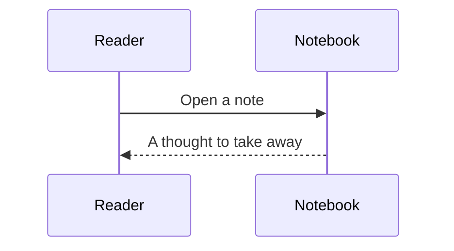

把阅读中的细节放在一起：文字、图片、公式，以及可以探索的数据。

<!--more-->

### 文字与节奏

好的排版，给思考留出空间。正文使用随站点提供的 Noto Sans SC，让长篇中文也能轻松阅读。这里有**清晰的强调**、*轻声的旁白*，还有[通往归档的链接](/archives/)。

> 写下来，是为了记住那些沿途曾经留意的事。

脚注让补充信息留在附近，又不打断句子。[^note]

- 一个短小的观察
- 一个值得重访的想法

### 提示与折叠


这是一条说明，支持 **Markdown** 内容。



阅读长文章时，可以用目录快速前往感兴趣的段落。



阅读图表前，记得核对数据背后的前提。



即使关闭 JavaScript，这段内容也可以展开阅读。




从能够看到的现象开始。可以使用方向键切换标签页。


再想一想，现象背后可能意味着什么。



### 代码

复制时不包含行号，也可以切换长行的换行显示。

```python {linenos=table,linenostart=7,hl_lines=[2]}
def greet(name):
    message = f"Hello, {name} — a deliberately long line to demonstrate horizontal scrolling without widening the article on a small screen."
    return message
```

```text {linenos=false}
Plain text remains readable, too.
```

### 公式

行内公式: \(a_{n+1} = a_n + 1\). 旧文兼容写法: $E = mc^2$.

$$
\sum_{i=1}^n i = \frac{n(n+1)}{2}
$$

\[
\begin{aligned}
f(x) &= \int_0^x t^2\,dt \\
     &= \frac{x^3}{3}
\end{aligned}
\]

### 表格

| 组件 | 键盘操作 | 小屏幕 | 关闭 JavaScript |
| :--- | :--- | :--- | :--- |
| 表格 | Tab / ← → | 局部横向滚动 | 保留完整数据 |
| 代码 | Tab / Enter | 滚动或换行 | 保留高亮源码 |
| 图表 | Tab / Enter | 自适应容器 | 保留说明和源配置 |

### 图片




### 一周的数据

```echarts {title="阅读与写作" description="阅读从周一的 30 分钟上升到周六的 75 分钟。点击图例筛选，拖动滑块缩放。"}
{
  "tooltip": {"trigger": "axis"},
  "color": ["#b87916", "#f6ba45"],
  "legend": {"top": 0, "left": 40, "icon": "circle", "data": ["Reading", "Writing"]},
  "grid": {"left": 45, "right": 20, "bottom": 72},
  "xAxis": {"type": "category", "axisLine": {"show": false}, "axisTick": {"show": false}, "data": ["Mon", "Tue", "Wed", "Thu", "Fri", "Sat", "Sun"]},
  "yAxis": {"type": "value", "name": "Minutes", "splitLine": {"show": false}, "axisLine": {"show": true}, "axisTick": {"show": true}},
  "dataZoom": [{"type": "slider", "start": 0, "end": 100}],
  "series": [
    {"name": "Reading", "type": "line", "smooth": true, "data": [30, 45, 35, 60, 40, 75, 65]},
    {"name": "Writing", "type": "bar", "itemStyle": {"borderRadius": [4, 4, 0, 0], "borderColor": "#b87916", "borderWidth": 1}, "data": [15, 20, 30, 25, 35, 50, 40]}
  ]
}
```



```echarts {title="时间与页数" description="四次观察中，阅读时间越长，读完的页数通常越多。" height="300"}
{"tooltip":{},"xAxis":{"name":"min"},"yAxis":{"name":"pages"},"series":[{"type":"scatter","data":[[15,8],[30,18],[45,22],[60,35]]}]}
```

### 流程与时序





### 原始 HTML

<details class="disclosure"><summary>原生 HTML 仍然可用</summary><div><p>现有内容可以继续沿用原始 HTML。</p></div></details>

[^note]: 一条简短的参考信息，可以跳回正文。

### 回环图形与字体

顶部导航排在环面下方的中央留白中，使用 [Ark Pixel Font](https://github.com/TakWolf/ark-pixel-font) 的 12px 字形，以 18px 展示。四个入口是纯文字页面链接，当前页面以暖黄色和下划线标记。右上角的语言、太阳、月亮、屏幕和搜索图标采用方格像素形状；配色也可用键盘方向键选择。

正文使用随站点提供的 Noto Sans SC，英文使用 Geist；代码与标注使用 JetBrains Mono。可变字重让标题保持清晰，正文保持舒展。

从一个问题出发，让下一次探索有迹可循。



### 回环标识

头像、页头和浏览器图标来自同一个倾斜环面。小尺寸减少辅助网格，加粗轮廓与暖黄色轨道，保留清楚的中心留白。


